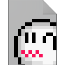

#  rkg-tool

GUI tool for Mario Kart Wii [ghost](https://wiki.tockdom.com/wiki/RKG_(File_Format)) and [save](https://wiki.tockdom.com/wiki/RKSYS) data files.

## Building from Source

### Instructions

1) Install [Apache Maven](https://maven.apache.org/).
2) Clone this repository.
3) Run `mvn package`. The output jar file and [launch4j](https://launch4j.sourceforge.net) executable will be in /target.

## Project Roadmap

- ### Version 0.1.0

  - [x] RKG File Handling (Feb 10th, 2024)
  - [x] Initial UI Window (Feb 10th, 2024)
  - [x] App Icon (Feb 19th, 2024)
  - [x] Tab Manager (Mar 3rd, 2024)
  - [x] Tab Close  (Mar 5th, 2024)
  - [x] Menu Bar (Mar 3rd, 2024)
  - [x] Dynamic Menu Bar (Mar 4th, 2024)
  - [x] About Window (Mar 3rd, 2024)
  - [x] File Opening (Mar 4th 2024)
  - [ ] (Batch) RKG File Renaming
  - [ ] Base Window UI
  - [ ] Initial RKG UI
  - [x] Migrate Project to Maven (Mar 3rd, 2024)
  - [x] Building with Maven (Mar 4th, 2024)

- ### Version 0.2.0

  - [ ] RKG File Exporting
  - [ ] RKG CRC16-CCITT-XModem Checksum
  - [ ] Editing for Some Basic RKG Header Values
  - [ ] Warn User of Unsaved Changes on Close/Exit
  - [ ] Warn User on Save
  - [ ] Ghost Mii Name Editing
  - [ ] Mii Data Exporting
  - [ ] Mii Data Replacement
  - [ ] Input Data Truncation
  - [ ] RKG UI Changes

- ### Version 0.3.0

  - [ ] RKSYS File Handling
  - [ ] RKSYS File Creation
  - [ ] RKSYS File Exporting
  - [ ] RKSYS CRC-32 Checksum
  - [ ] RKSYS Edit Region
  - [ ] RKSYS Unlock All
  - [ ] Add Ghost to RKSYS File
  - [ ] RKSYS UI

- ### Version 0.4.0

  - [ ] Preferences Window
  - [ ] Preferences Saving
  - [ ] Preference: RKSYS Default Region
  - [ ] Preference: Show Region Prompt
  - [ ] Preference: Show Save Warning
  - [ ] Preference: Light Theme (FlatLaf Light)
  - [ ] Menu Bar Keybindings

- ### Version 1.0.0

  - [ ] CTGP Extended Ghost Info Handling
  - [ ] CTGP Pause Inputs RKG Files Handling
  - [ ] UI Extension for RKG files from CTGP
  - [ ] Add CTGP Extended Ghost Info to RKG UI
  - [ ] Add CTGP Database URL to RKG UI
  - [ ] Add CTGP Pause Input Viewing to RKG UI

- ### Unplanned/Potential Features

  - [ ] Custom Top 10 Leaderboard Support
  - [ ] Export Input Display Video with [PyRKG](https://github.com/AtishaRibeiro/PyRKG)
  - [ ] Import Ghost from Ninrankings/MKLeaderboards/Chadsoft
